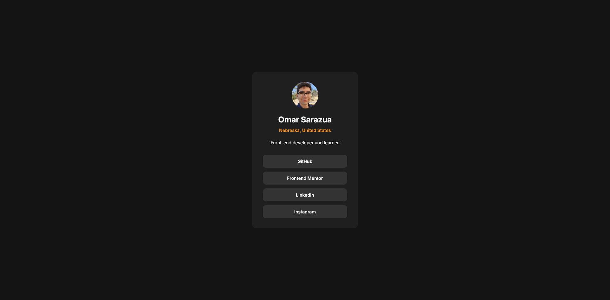

# Frontend Mentor - Social links profile solution

This is a solution to the [Social links profile challenge on Frontend Mentor](https://www.frontendmentor.io/challenges/social-links-profile-UG32l9m6dQ). Frontend Mentor challenges help you improve your coding skills by building realistic projects. 

## Table of contents

- [Overview](#overview)
  - [The challenge](#the-challenge)
  - [Screenshot](#screenshot)
  - [Links](#links)
- [My process](#my-process)
  - [Built with](#built-with)
  - [What I learned](#what-i-learned)
- [Author](#author)

## Overview

This is a social links profile page with a simple card like presentation. This is my upload for the Front End Mentor Challenge

### The challenge

Users should be able to:

- See hover and focus states for all interactive elements on the page

### Screenshot

### Links

- Solution URL: [Add solution URL here](https://your-solution-url.com)
- Live Site URL: [Add live site URL here](https://your-live-site-url.com)

## My process

I began with html and css and used previous css classes to speed up the process and tried to experiment with different ideas

### Built with

- Semantic HTML5 markup
- CSS custom properties
- Flexbox
- Mobile-first workflow

### What I learned

I learned more about how to use the width property to make responsive designs that can move with the screen size. I did this by making the container for links a percentage of the container of the card. 

## Author

- Website - [Omar](https://omarsanchezsar-lxzih.wordpress.com/)
- Frontend Mentor - [@Onarsaurus](https://www.frontendmentor.io/profile/Onarsaurus)